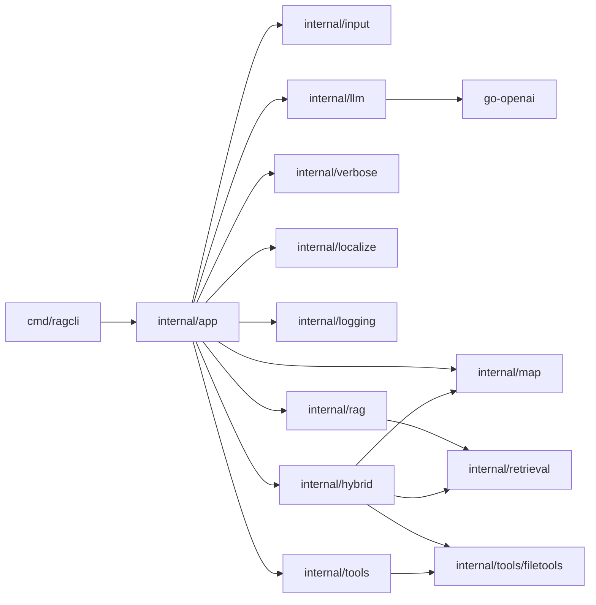
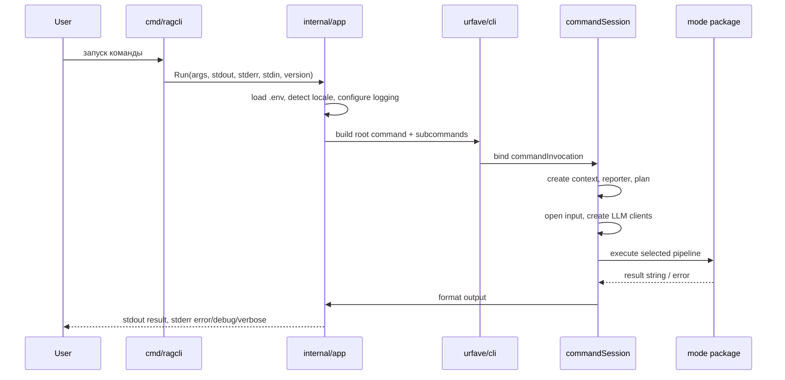
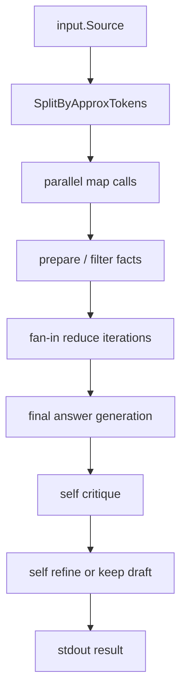
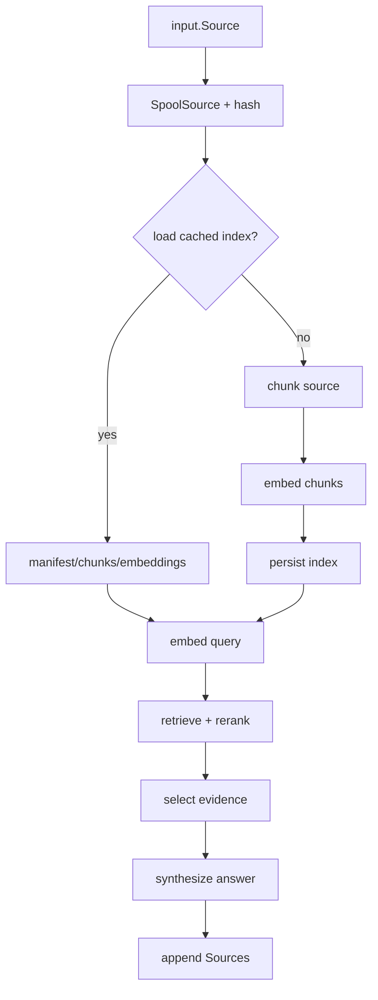

# Архитектура `ragcli`

## 1. Сводка

`ragcli` построен как CLI-оболочка над набором режимов обработки текста. Архитектурно проект разделён на:

- тонкую точку входа `cmd/ragcli`;
- orchestration-слой `internal/app`;
- mode-пакеты `map`, `rag`, `hybrid`, `tools`;
- shared infrastructure: `llm`, `input`, `retrieval`, `verbose`, `localize`, `logging`.

Главный принцип: `internal/app` связывает CLI, input lifecycle, создание клиентов и вывод результата, а domain-specific пайплайны живут в отдельных пакетах режимов.

## 2. Слои и зависимости

### Правила зависимостей

- `cmd/ragcli` не содержит логики кроме вызова `app.Run`.
- `internal/app` знает про все режимы и shared packages; режимы не знают про CLI.
- `internal/map` не зависит от retrieval и tool calling.
- `internal/rag` и `internal/hybrid` используют `internal/retrieval` как общее ядро файлового retrieval.
- `internal/tools` оркестрирует tool calling, а перечисление файлов и чтение строк делегирует `internal/tools/filetools`.
- Исключение к чистой изоляции режимов: `internal/hybrid` использует `internal/map` как fallback path.

## 3. Жизненный цикл запуска

### Ключевые runtime-этапы

1. `app.Run` подгружает `.env`, определяет locale и настраивает `slog`.
2. `newCLI` строит `urfave/cli` дерево из `commandSpec`.
3. `bind*Invocation` собирает `commandInvocation` с нормализованными options.
4. `appRuntime.execute` создаёт `commandSession`, progress plan и сигнал-совместимый context.
5. `withInput` открывает файл или материализует `stdin`.
6. `withChatInput` / `withChatAndEmbeddingInput` создают клиентов и вызывают mode package.
7. `writeResult` форматирует markdown-ответ и печатает его в `stdout`.

## 4. Общие абстракции

### 4.1 `input.Source`

`input.Source` — общий wire-object между orchestration-слоем и режимами:

- `Descriptor` — metadata входа: kind (`stdin` / `file` / `directory`), исходный path и список файлов корпуса.
- `SnapshotPath()` — фактический path до materialized snapshot, который можно переоткрывать в downstream-пайплайнах.
- `Open()` — повторно открывает snapshot как `io.ReadCloser` без хранения живого reader внутри `Source`.
- Методы `InputPath()`, `DisplayName()`, `BackingFiles()` и `IsMultiFile()` скрывают различия между file, directory и `stdin`.
- Поверх concrete type пакет даёт capability-интерфейсы `SourceMeta`, `SnapshotSource` и `FileBackedSource` для mode-пакетов.

Эта абстракция позволяет всем режимам одинаково работать с `--path`, compatibility alias `--file` и `stdin`.

### 4.2 LLM adapters

`internal/llm` даёт два интерфейса:

- `ChatAutoContextRequester` — chat completion + auto context length resolve;
- `EmbeddingRequester` — embeddings API.

Поверх `go-openai` пакет добавляет:

- retry с exponential backoff;
- request/embedding metrics;
- proxy configuration;
- auto-detect контекста модели через LM Studio models endpoint или probe по ошибке.

### 4.3 Progress model

`internal/verbose` задаёт stage-based progress contract:

- `commandSpec.template` описывает stages и slots;
- `verbose.Plan` превращает их в `Meter`;
- конкретные режимы only report progress по ключам стадий, не зная о рендеринге.

Это позволяет тестировать progress отдельно от business logic.

### 4.4 Локализация и логирование

- `internal/localize` хранит встроенные TOML-каталоги и даёт `T()` для текстов CLI.
- `internal/logging` конфигурирует `slog` и укорачивает source paths относительно корня проекта.

## 5. Пайплайны режимов

### 5.1 `map`

Реальный pipeline:

1. `resolveChunkLength` берёт явный `--length` или пытается автоопределить контекст модели.
2. `SplitByApproxTokens` режет текст по строкам с approximate token budget.
3. `runMapParallel` запускает map-запросы к LLM параллельно.
4. Пустые/`SKIP` ответы отбрасываются, оставшиеся факты нормализуются.
5. `fanInReduce` схлопывает результаты батчами до одного блока фактов.
6. Генерируется финальный draft-answer.
7. `selfRefine` делает critique и, если нужно, refine проход.

Сильные стороны:

- независимость от embeddings;
- хороший fit для summary и broad question по очень длинному тексту.

Компромиссы:

- между чанками теряется часть глобального контекста;
- на слабых моделях качество critique/refine может быть неровным.

### 5.2 `rag`

Реальный pipeline:

1. Вход спулится во временный файл и получает hash с учётом параметров индекса.
2. Индекс грузится из кэша или строится заново.
3. Query embed-ится отдельно.
4. Retrieval ранжирует кандидаты по сходству и lexical overlap.
5. Выбираются `final-k` evidence chunks.
6. LLM отвечает только по evidence.
7. В ответ добавляется секция `Sources:`.

Файловые артефакты индекса:

- `manifest.json`
- `chunks.jsonl`
- `embeddings.jsonl`

### 5.3 `hybrid`

`hybrid` — самый сложный режим. Он совмещает retrieval, локальное дочитывание и map-style извлечение фактов.

Основной pipeline:

1. `spoolSourceSnapshot` сохраняет вход и одновременно собирает статистику для document profiling.
2. `detectProfile` выбирает профиль `markdown`, `logs`, `plain`, `unknown`.
3. Документ сегментируется в meso-segments.
4. Выполняются lexical и semantic retrieval.
5. Хиты сливаются в regions, расширяются и ранжируются.
6. `groundEvidence` дочитывает окна вокруг лучших линий.
7. `mapExtractFacts` вытаскивает факты по top regions.
8. `checkCoverage` проверяет, достаточно ли evidence и нет ли противоречий.
9. Если coverage слабое, строится follow-up query и запускается targeted reread.
10. Финальный ответ синтезируется по фактам и evidence, затем получает `Sources:`.

Fallback semantics:

- `map` — при проблемах semantic retrieval или пустой финал переключается на `map` pipeline.
- `rag-only` — semantic errors деградируют до lexical-only поведения без падения.
- `fail` — ошибка пробрасывается наружу.

Архитектурная особенность: `hybrid` — единственный режим, который легально импортирует другой режим (`internal/map`) как fallback-реализацию.

### 5.4 `tools`

`tools` не строит retrieval index и не загружает файл в prompt целиком. Вместо этого режим оркестрирует диалог модели с локальными file-tools: `list_files`, `search_file`, `read_lines`, `read_around`.

Реальный pipeline:

1. Создаётся tools session с `system` и `user` сообщениями.
2. В каждом turn отправляется chat request с tool definitions.
3. Если модель запросила tool calls, `toolLoopState` выполняет их локально.
4. Результаты возвращаются как `role=tool` сообщения в JSON.
5. Loop отслеживает duplicate calls, already-seen строки и уже перечисленные пути, а также no-progress runs.
6. При зацикливании включаются защитные ветки: retry without tools, stop-calls prompt, forced finalization.
7. Режим завершает работу, когда получает содержательный финальный text answer.

Почему `filetools` вынесен отдельно:

- JSON-контракты инструментов должны переиспользоваться;
- line-based доступ удобнее тестировать отдельно от orchestration loop;
- часть line-grounding логики повторно полезна в `hybrid`.

## 6. Файловые и временные артефакты

| Артефакт | Кто создаёт | Зачем | Lifecycle |
| --- | --- | --- | --- |
| temp file from `stdin` | `internal/input` | дать режимам path + random access | удаляется в `Handle.Close()` |
| spooled source for `rag` | `internal/retrieval` | стабильный hash и повторное чтение | удаляется после завершения run |
| spooled source for `hybrid` | `internal/hybrid` через `retrieval.SpoolSource` | profiling, segmentation, reread | удаляется после завершения run |
| index dir | `internal/rag`, `internal/hybrid` | кэш embeddings и metadata | живёт до TTL cleanup |

## 7. Что считать публичным поведением

Публичным поведением проекта считаются:

- CLI-команды, флаги, env-переменные и defaults;
- разделение `stdout`/`stderr`;
- наличие локализации `ru`/`en`;
- semantics режимов `map`, `rag`, `hybrid`, `tools`;
- формат источников в ответах `rag` и `hybrid`.

Не считаются жёстким public API:

- точные внутренние структуры `commandInvocation`, `pipelineStats`, `toolLoopState`;
- конкретные progress labels;
- конкретные названия внутренних helper functions.

## 8. Куда расширять систему

- Новый режим добавляется через `internal/<mode>` + регистрацию в `internal/app/commandspec.go`.
- Новая общая файловая функциональность сначала оценивается на перенос в `internal/retrieval` или `internal/tools/filetools`, а не в отдельный режим.
- Изменения CLI-описания в `internal/app` должны сопровождаться обновлением `doc/requirements.md`, `README.md` и package-level README соответствующих пакетов.
